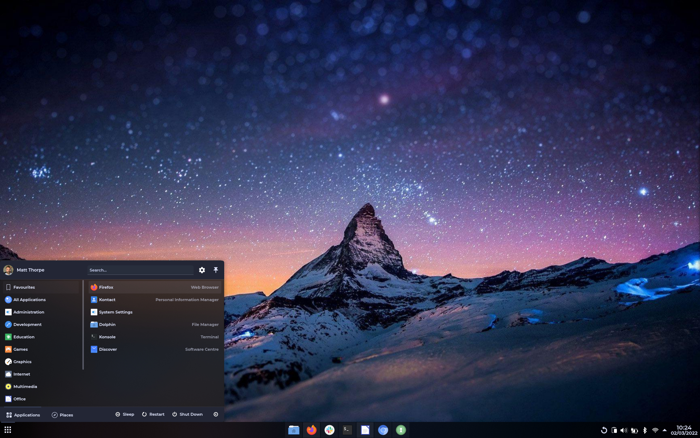
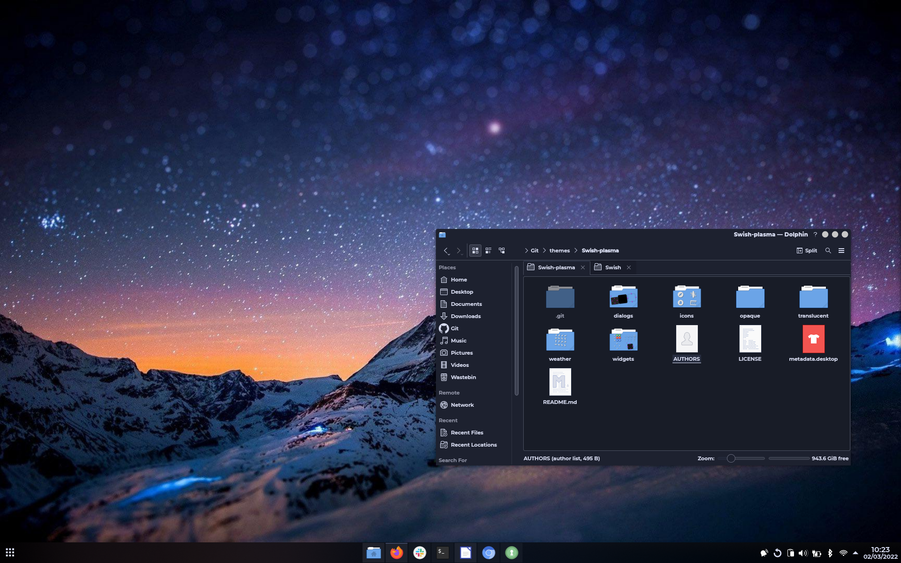

# Swish-plasma

My take on a comfortable plasma theme, modifications on the Materia-dark plasma theme, with some blur and the system icons from the spectacular Miya theme, credit to the original creators

[Materia KDE](https://github.com/PapirusDevelopmentTeam/materia-kde)

[Miya KDE](https://github.com/yeyushengfan258/Miya-kde)

Colours 'Shadows-dark'
Icons 'Qogir-dark'

link to original wallpaper [https://wallpapercave.com/download/night-mountain-wallpapers-wp2532971](https://wallpapercave.com/download/night-mountain-wallpapers-wp2532971)
